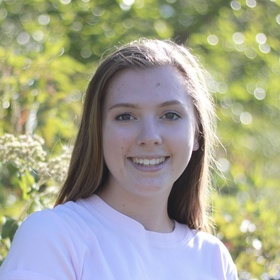

# About

I'm currently a master's student in the Accelerated Master's Program of Biology at the University of Vermont. I will receive my B.Sc. in Biological Science from the University of Vermont in May 2021. I'm originally from Pembroke, New Hampshire. My research focuses on bioacoustics to understand the soundscape of Bocas del Toro, Panama. I look at the impact of anthropogenic boat noise on Bocon Toadfish (*Amphichthys cryptocentrus*) communication, as well as stress from tour boats on Bottlenose dolphins (*Tursiops truncatus*) which is reflected in their whistles.

# Toadfish project

# Bottlenose dolphin COVID project

# Education

University of Vermont. 2017-2021. B.Sc Biological Science.
University of Vermont. 2020-current. M.Sc Biology Student

# Publications

# Contact
Emma Gagne  
Department of Biology  
University of Vermont
Lab: Marsh Life Science 217
Email: emma.gagne@uvm.edu