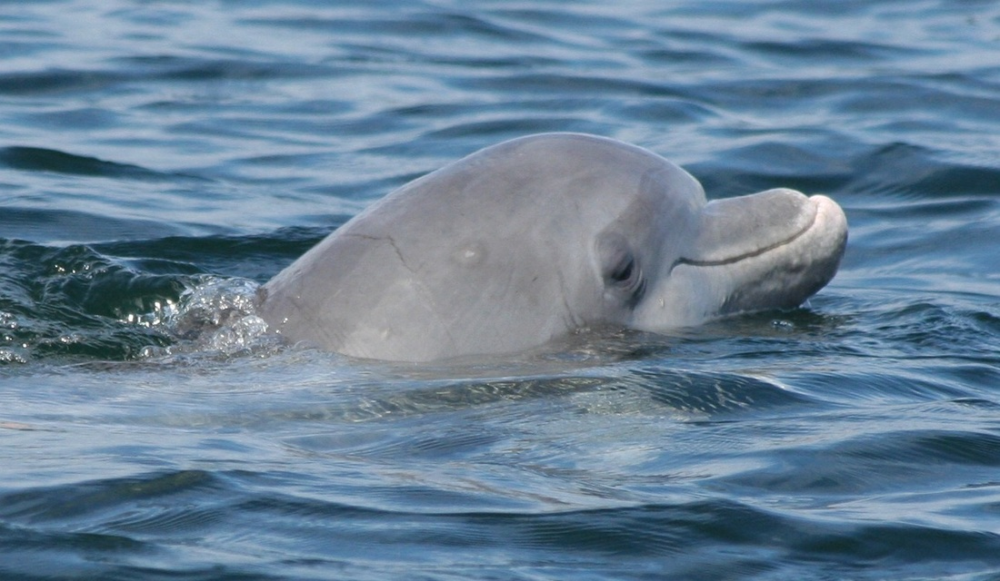

# About

I'm currently a master's student in the Biology Department at the University of Vermont. I received my B.Sc. in Biological Science from the University of Vermont in May 2021. I'm very passionate about making science accessible for all, including those in under-represented communities.

In Dr. Laura May-Collado's lab, we examine how ecological and anthropogenic factors influence acoustic communication in marine vertebrates. My research utilizes bioacoustics to understand the soundscape of Bocas del Toro, Panama. I look at the impact of anthropogenic boat noise on Bocon Toadfish (*Amphichthys cryptocentrus*) communication, as well as the impact of tour boats on Bottlenose dolphin (*Tursiops truncatus*) whistle structure and repertoire. I combine both traditional approaches, as well as methods from recent advances in machine-learning.

# Bottlenose dolphin COVID project

Co-contributors: Betzi Perez-Ortega, Andrew P. Hendry, Gabriel Melo-Santos, Sam F. Walmsley, Manali Rege-Colt, Maia Austin, Laura J. May-Collado

**Abstract**: Underwater noise from human activities is recognized as a world-wide problem, with important repercussions on aquatic mammal’s acoustic communication. During the COVID-19 pandemic, the  government of Panama went into a nationwide lockdown to limit the spread of the virus. This lockdown resulted in the closing of tourism infrastructure and limited mobility in both land and coastal areas. We used this “natural experiment” as an opportunity to study the impact of tour-boat activities on dolphin communication by deploying bottom-mounted underwater autonomous recorders in Dolphin Bay in the archipelago of Bocas del Toro, Panama. We extracted whistle contours to measure acoustic structure and used an adaptive resonance theory neural network combined with dynamic time-warping (ARTwarp) to categorize whistles into types. During thelockdown, tour-boat activity was absent, but boats were permitted to transport people and supplies. The shift in type of boat activity within the lockdown resulted in lower ambient noise levels and higher acoustic detection of dolphin sounds. Increased dolphin acoustic detections during lockdowns was suggested by a higher proportion of recordings containing dolphin sounds and a more diverse whistle repertoire than in the pre-lockdown period. A Random Forest Analysis classified whistles between the two periods with high accuracy (92.4% accuracy, κ = 0.85) based primarily on whistle duration and modulation. During the lockdown, whistles were on average longer in duration and less modulated than during the pre-lockdown. Our study shows that a shift in boat traffic activity can generate significant changes on dolphin’s habitat, and in their communicative signals, an important consideration given ongoing unregulated ecotourism in the region.

# Bocon Toadfish (*Amphichthys cryptocentrus*) Project

**Abstract**: Male bocon toadfish (*Amphicthys cryptocentrus*) are found throughout the Bocas del Toro archipelago of Panama in pockets of coral reefs where they establish territories under rocky habitat. They generate calls consisting of ‘grunts’ and ‘boops,’ to advertise their fitness to females, drawing them to their small burrows to mate. Males not only have to outcompete nearby calling males but also minimize the impact of acoustic masking by taxi-boats. To study the impact of boat traffic and associated noise on toadfish call acoustic structure, we deployed calibrated autonomous underwater recorders before and during COVID-19 restrictions in Almirante Bay, an area of high taxi-boats transit between the mainland and the archipelago. The results from this study show noise levels decreased during the COVID-19 pandemic restrictions, and that during this time toadfish call detection rate increased, calls had a broader frequency range, lower amplitude, and a higher signal-to-noise ratio.

[Poster Presentation](SRC2020.pptx)

# Education

University of Vermont. 2020-2022 M.Sc. Biology.  
University of Vermont. 2017-2021. B.Sc. Biological Science.  

# Publications
1. Submitted for Publication, May 2022:  
**Frontiers in Remote Sensing**  
*Emma Gagne*, Betzi Perez-Ortega, Andrew Hendry, Gabriel Melo-Santos, Sam Walmsley, Manali Rege-Colt, Maia Austin, Laura J. May-Collado.  
**“Dolphin communication during widespread systematic noise reduction-a natural experiment during COVID-19 lockdowns.”**

2. To be Submitted for Publication, May 2022:  
**Scientific Reports**   
Manali Rege-Colt, Julie N. Oswald, Joëlle De Weerdt, Jose David Palacios, Maia Austin, *Emma Gagne*, Laura J. May-Collado.  
**“Whistle characterization and repertoire comparison of coastal and offshore pantropical spotted dolphins in the eastern tropical pacific.”**

# Contact
Emma Gagne  
Department of Biology  
University of Vermont  
Lab: Marsh Life Science 224  
Email: emma.gagne@uvm.edu  
[researchgate](https://www.researchgate.net/profile/Emma-Gagne)